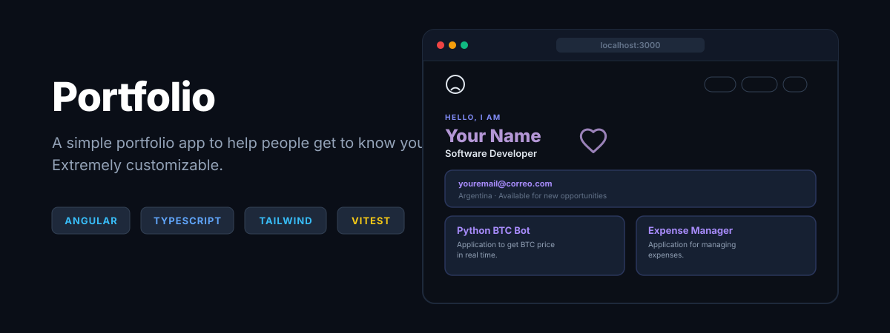

# Portfolio

<p align="center">
  <a href="https://ivanepais.github.io/portfolio/">
    
  </a>
</p>

A simple portfolio app to help people get to know you. Extremely customizable.

---

## 💻 App

> 🚀 **Try the app!** using the link: **[portfolio](https://ivanepais.github.io/portfolio)** or click on the banner.

---

## 🌟 Features

* **All your data in one place:** With just a simple JSON modification, your data will appear instantly.
* **Personalization with a few tokens:** You can add your personal touch by modifying the style tokens and modular components.
* **SEO Ready:** With robots, sitemap and schema you activate the crawlers and bots of web search engines to achieve ranking.

---

## 🏗️ Architecture and Structure

Three layers are implemented to ensure that the data arrives correctly and consistently..

```text
app/
├── application/            # Defines the data to be displayed and the system's behavior around it
│   ├── ports/              # Information that the application will obtain
│   └── use-cases/          # It will give access to the content
├── domain/                 # Defines business entities
├── infrastructure/         # Use a data source and implement them
│   ├── adapters/           # Data transformation and implementation
│   ├── dtos/               # It represents the data as it naturally arrives in the app
│   └── mappers             # It gives a homogeneous format to the natural data so that the app can understand it
├── presentation/           # User interface (UI) components
│   └── services            # Request the content from the application layer so that the UI components can display it     
```

---

## 🚀 Local Installation and Implementation

To set up the local development environment and run the application on your computer

1. **Clone the repo:**
Download the copy of the project to your machine using the terminal.

```sh
git clone https://github.com/ivanepais/portfolio.git
```

2. **Access the repo:**
Navigate to the root folder where the project settings are located.

```sh
cd portfolio
```

3. **Install dependencies:**
With NodeJS, you can download and install all the necessary packages and libraries specified in the configuration file.

```sh
npm install
```

4. **Start the development server:**
Start the local server to view and test the application in real time in your browser

```sh
ng serve
```   

5. **Build:**
You can build your version to run on a server.

```sh
ng build

npm install -g http-server
```   

In the path `portfolio/dist/portfolio/browser` run the server

```sh
http-server
```

---

**Testing Suite:**

```sh
ng test
```

---

## 📄 License

This project is licensed under the MIT License.
See the file [LICENSE](LICENSE) for more details.